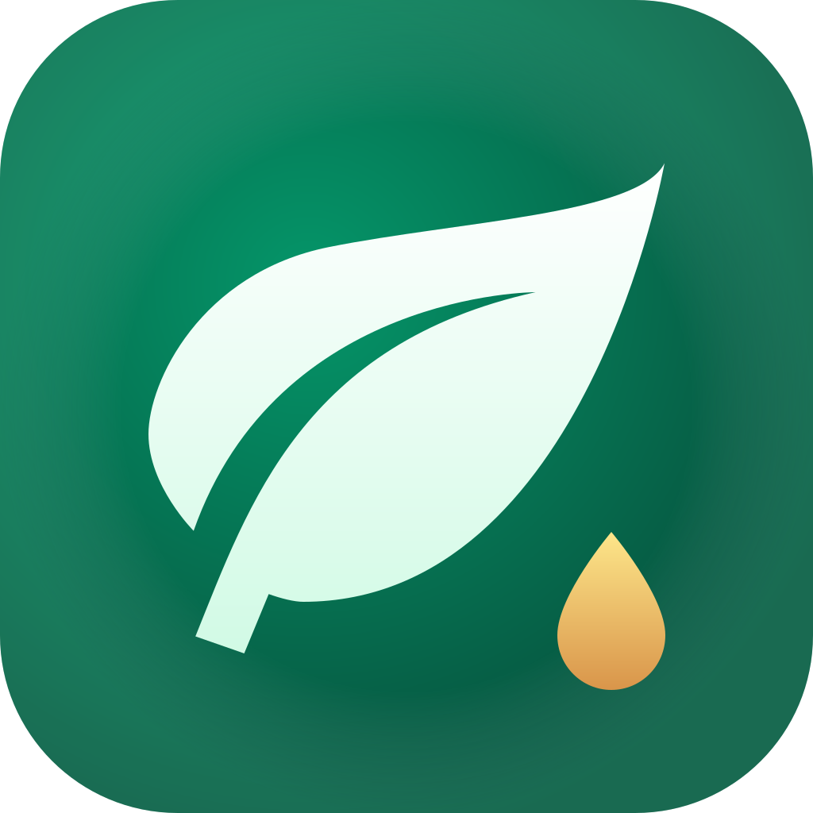

# Plant Care Self-Hosted

<p align="center">
  
</p>

Self-hosted plant tracker with a Vue 3 frontend, a Bun + Hono API, SQLite storage, and an optional Tauri desktop shell.

This README describes the code currently in the repository, including the parts that are fully wired up and the parts that are only partial.

## Overview

The project is split into three runtime pieces:

- `src/`: a Vue 3 single-page app for browser and Tauri
- `server/`: a Bun + Hono API with SQLite via Drizzle ORM
- `src-tauri/`: a thin desktop wrapper around the same frontend

The deployed Docker setup serves the built SPA with Nginx and reverse-proxies `/api/*` to the Bun server.

## What Is Implemented

- Account registration, login, logout, session restore, and refresh-token rotation
- Plant collection management: add, edit, delete, and browse your plants
- Per-plant moisture logs and watering history
- Estimated next-watering date based on species baseline, recent watering intervals, seasonality, and latest moisture reading
- Plant photo upload, replacement, fetch, and delete
- Species catalog with seeded images, translated content, search, and filters
- Water guide based on species water-hardness tolerance and a user-selected water profile
- English and Italian UI translations
- Settings for language, password/email change, JSON export, JSON import, and logout
- Admin API endpoints for managing catalog species, translations, images, and water presets

## Current Data Set

The checked-in seed data contains:

- `38` species
- `76` species translations (`38` English, `38` Italian)
- `107` water presets

Catalog data and images are stored in the database after seeding.

## How It Works

### App bootstrap

On startup the frontend:

1. Restores the auth session from tokens stored in `localStorage`
2. Waits for that auth check before allowing private routes
3. If the user is logged in, fetches catalog data, user plants, and water presets in parallel

The router uses hash history (`/#/...`), and the API client automatically retries a request once after refreshing the access token on `401`.

### Auth

- Access tokens expire after `15 minutes`
- Refresh tokens expire after `7 days`
- Refresh tokens are stored in SQLite and rotated on refresh
- Login and register are rate-limited in memory to `10 requests / 15 minutes / IP`

### Plant data

Each user plant stores:

- selected species
- nickname
- location
- notes
- watering dates
- moisture logs
- optional photo stored as binary in SQLite

Plant photos are uploaded separately from plant creation. In the UI, species images are the fallback when a custom plant photo does not exist.

### Catalog

The catalog is public on the API side and is seeded from:

- `server/data/species.json`
- `server/data/translations.json`
- `server/data/compressed/`

The frontend lazily requests species images and caches them as object URLs.

### Water guide

The water guide compares a plant's `waterHardnessTolerance` against the user's selected water profile and shows:

- a warning banner when the profile is too hard for that species
- recommended water-source badges
- general water-use guidance for the selected hardness level

The frontend persists the water profile to the backend (`PATCH /user/me`) and restores it from `/user/me` on session bootstrap. A local copy is still kept as a cache/fallback.

### Import and export

The settings screen supports a simple JSON backup flow:

- Export writes a JSON backup file with plants, logs, watering dates, and plant photos
- Import restores plants through the API and replays saved history (including timestamps)

Current behavior to be aware of:

- Import replaces existing plants first (`DELETE /plants`) after user confirmation in settings
- Plant photos are included in backups as base64 payloads
- Watering dates and moisture logs preserve their saved timestamps

## Tech Stack

| Layer | Technology |
|---|---|
| Frontend | Vue 3 + TypeScript |
| State | Pinia |
| Routing | Vue Router |
| i18n | Vue I18n |
| Styling | Tailwind CSS |
| Charts | Chart.js + vue-chartjs |
| Backend | Hono + Bun |
| Database | SQLite + Drizzle ORM |
| Desktop shell | Tauri v2 |
| Reverse proxy | Nginx |

## Local Development

### Prerequisites

- Node.js `18+`
- Bun `1.1+`
- Rust and Tauri prerequisites only if you want the desktop build

### 1. Configure environment

Frontend env in the repo root:

```bash
cp .env.example .env
```

Example:

```env
VITE_API_URL=http://localhost:3000
```

Backend env in `server/`:

```bash
cd server
cp .env.example .env
```

Example:

```env
PORT=3000
DB_PATH=./local-plant-care.db
JWT_SECRET=replace_with_a_long_random_secret
JWT_REFRESH_SECRET=replace_with_a_different_long_random_secret
ADMIN_SECRET=replace_with_a_random_admin_secret
CORS_ORIGIN=http://localhost:1420
```

### 2. Start the backend

```bash
cd server
bun install
bun run dev
```

Notes:

- `bun run dev` now runs migrations, seeds the local database, and then starts the watch server
- if you are already in the repository root, `npm run server:dev` does the same thing
- `src/index.ts` also applies migrations automatically on every server start
- `bun run db:seed` is safe to rerun if you want to refresh the seeded catalog data manually
- the API listens on `http://localhost:3000` by default
- `GET /health` returns a simple health response

### 3. Start the frontend

From the repository root:

```bash
npm install
npm run dev
```

Vite runs on `http://localhost:1420`.

### 4. Run the Tauri shell

```bash
npm run tauri dev
```

The Tauri app does not embed or start the backend for you. The Bun API still needs to be running separately.

## Docker Deployment

The repository includes a two-container deployment:

- `server`: Bun API + SQLite database stored in a Docker volume
- `frontend`: static Vite build served by Nginx, with `/api/*` proxied to the server container

### First deploy

```bash
cp .env.example .env
```

Set the frontend build URL in the root `.env`:

```env
VITE_API_URL=http://<host>/api
```

Then create `server/.env` from `server/.env.example` and set at least:

```env
PORT=3000
DB_PATH=./plant-care.db
JWT_SECRET=replace_with_a_long_random_secret
JWT_REFRESH_SECRET=replace_with_a_different_long_random_secret
ADMIN_SECRET=replace_with_a_random_admin_secret
CORS_ORIGIN=http://<host>
```

Then build and start:

```bash
docker compose up -d --build
```

Seed the database once after the server container is up:

```bash
docker compose exec server bun run db:seed
```

### Update deploy

`deploy.sh` does:

```bash
git pull --ff-only
docker compose up -d --build
docker image prune -f
```

### Current deploy notes

- The supplied Nginx config always serves HTTP on `80`
- `GET /healthz` on port `80` is kept as a plain-HTTP container health endpoint
- HTTPS on `443` is enabled only when `nginx/certs/fullchain.pem` and `nginx/certs/privkey.pem` are mounted
- The backend port `3000` is only exposed inside the Docker network

## Admin and Catalog Maintenance

There is no admin UI in the frontend. Catalog and water-preset maintenance currently happens through the API:

- `POST/PATCH/DELETE /admin/catalog...`
- `PUT /admin/catalog/:id/image`
- `PUT/DELETE /admin/catalog/:id/translations/:lang`
- `POST/PATCH/DELETE /admin/water-presets...`

All admin routes require the `X-Admin-Secret` header.

### Image pipeline note

The repository currently contains seeded catalog images as `.webp` files in `server/data/compressed/`.

The checked-in helper script:

```bash
npm run optimize-images
```

writes `.webp` files into `server/data/compressed/`, and `server/scripts/seed.ts` imports that same `.webp` format into SQLite. The optimization/seed pipeline is aligned end-to-end.

## Project Structure

```text
src/                 Vue SPA
  components/        UI building blocks
  composables/       Theme and water-guide helpers
  i18n/              English and Italian strings
  lib/               API client with token refresh
  router/            Route config and auth guard
  stores/            Pinia stores for auth, plants, catalog, water profile
  views/             Login, home, catalog, detail, water guide, settings
server/              Bun + Hono API
  data/              Seed JSON and catalog images
  drizzle/           SQL migrations
  scripts/           Seed script
  src/               routes, middleware, DB schema, JWT helpers
src-tauri/           Tauri desktop wrapper
nginx/               Reverse-proxy config for Docker deploy
scripts/             Root maintenance scripts
```

## Known Gaps

- There is still no admin UI in the frontend; catalog and water-preset maintenance is API-only

## License

MIT - see [LICENSE](LICENSE).
